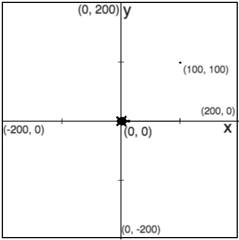

### **Essential `Turtle()` Methods**

#### Coordinate Plane

| Method | Description | Example |
|---------|------------|---------|
| `forward(distance)` or `fd(distance)` | Moves the turtle forward by the specified `distance`. | `t.forward(100)` |
| `backward(distance)` or `bk(distance)` | Moves the turtle backward by the specified `distance` (without changing direction). | `t.backward(50)` |
| `right(angle)` or `rt(angle)` | Rotates the turtle **clockwise** by `angle` degrees. | `t.right(90)` |
| `left(angle)` or `lt(angle)` | Rotates the turtle **counterclockwise** by `angle` degrees. | `t.left(45)` |
| `goto(x, y)` or `setpos(x, y)` or `setposition(x, y)` | Moves the turtle to the specified `(x, y)` coordinates. | `t.goto(50, 100)` |
| `penup()` or `pu()` | Lifts the pen so the turtle moves without drawing. | `t.penup()` |
| `pendown()` or `pd()` | Lowers the pen to resume drawing. | `t.pendown()` |
| `pensize(width)` | Sets the thickness of the pen stroke. | `t.pensize(5)` |
| `pencolor(color)` | Sets the pen color. Accepts color names (`"red"`), hex (`"#FF0000"`), or RGB tuples. | `t.pencolor("blue")` |
| `fillcolor(color)` | Sets the fill color for shapes. | `t.fillcolor("yellow")` |
| `begin_fill()` | Starts filling a shape with the specified `fillcolor`. | `t.begin_fill()` |
| `end_fill()` | Ends filling the shape. | `t.end_fill()` |
| `circle(radius, extent=None, steps=None)` | Draws a circle with `radius`. `extent` defines the arc angle. `steps` define a polygonal approximation. | `t.circle(50)` |
| `speed(speed)` | Sets the turtle's speed (0-10). `0` is instant, `1` is slow, `10` is fastest. | `t.speed(5)` |
| `home()` | Moves the turtle back to the origin `(0,0)` and resets direction to the right (0°). | `t.home()` |
| `clear()` | Clears the drawing without moving the turtle. | `t.clear()` |
| `reset()` | Clears the drawing and resets the turtle's position and direction. | `t.reset()` |
| `hideturtle()` or `ht()` | Hides the turtle icon (useful for faster drawing). | `t.hideturtle()` |
| `showturtle()` or `st()` | Makes the turtle icon visible. | `t.showturtle()` |
| `isvisible()` | Returns `True` if the turtle is visible, `False` otherwise. | `print(t.isvisible())` |
| `heading()` | Returns the turtle's current heading (angle in degrees). | `print(t.heading())` |
| `setheading(angle)` | Sets the turtle's direction to `angle` degrees. | `t.setheading(90)` |
| `pos()` or `position()` | Returns the turtle's current `(x, y)` position as a tuple. | `print(t.pos())` |
| `xcor()` | Returns the turtle’s current x-coordinate. | `print(t.xcor())` |
| `ycor()` | Returns the turtle’s current y-coordinate. | `print(t.ycor())` |
| `write(text, move=False, align="left", font=("Arial", 8, "normal"))` | Writes `text` at the turtle’s position with optional alignment and font settings. | `t.write("Hello!", align="center", font=("Arial", 12, "bold"))` |
| `stamp()` | Leaves an imprint of the turtle at its current position. | `t.stamp()` |
| `undo()` | Undoes the last turtle action. | `t.undo()` |

